<p align="center">
  
</p>

<h1 align="center">FICSIT Planner</h1>

<p align="center">
  <a href="https://github.com/Albis0/ficsit_planner/actions/workflows/ci.yml"></a>
  <a href="LICENSE"></a>
</p>

<p align="center"><b><a href="https://ficsit-planner.pages.dev">Open FICSIT Planner → ficsit-planner.pages.dev</a></b></p>

<p align="center">
  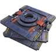
  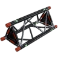
  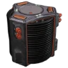
  
  
  
  
  
  
  
  
  
</p>

Production planner for Satisfactory that runs in the browser and works offline. Pick what you want to make
and how many per minute. A linear programming solver ([HiGHS](https://highs.dev), compiled to WebAssembly)
picks the recipes, counts the machines, sets their clock speeds and draws the factory as belts and pipes.

It's a static site you can install as an app (a PWA). Chrome, Edge and Android add a desktop or home-screen
shortcut, and iPhone and iPad do the same through the Share menu. Once installed it opens in its own window
and works without a network. There's nothing to download and run. It works on phones and tablets too.

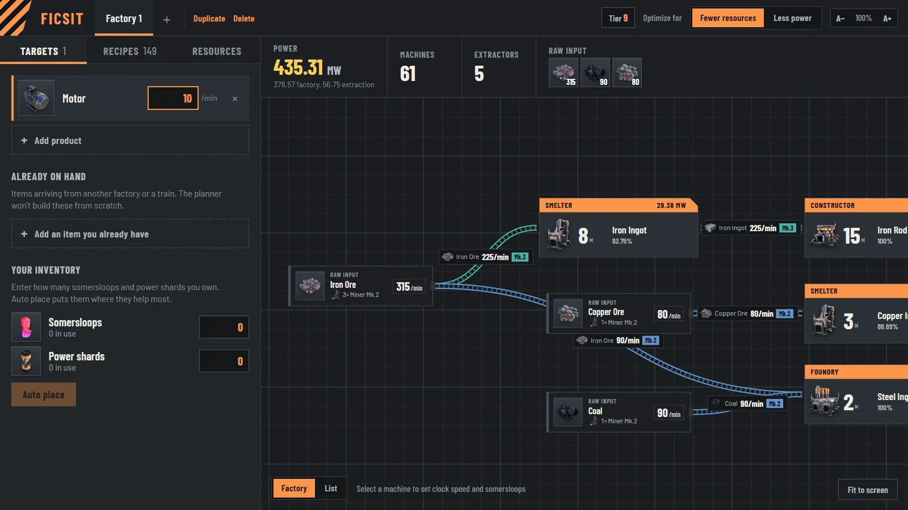

<p align="center">
  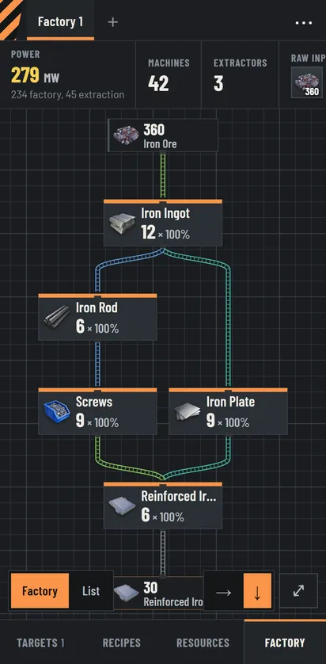
  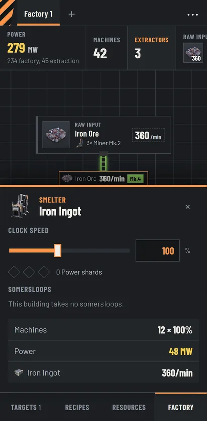
  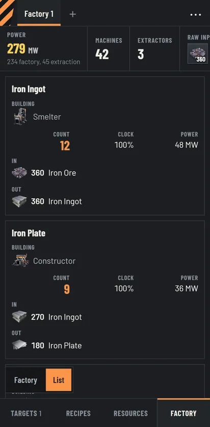
</p>

## Features

| | |
| :-: | --- |
| 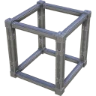 | **Targets and factories.** Add as many products per factory as you want, each at its own rate. Factories live in tabs you can rename, duplicate and delete. Everything is saved in the browser. |
|  | **On-hand items.** Parts that arrive from another factory or by train. The planner uses them instead of building them from scratch. |
| 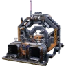 | **Recipe control.** Standard, alternate and converter recipes are grouped by product, and each one can be switched on or off. If an input can't be made with the enabled recipes, it gets flagged with a one-click "add as on hand" button. |
|  | **Knows your progress.** On first launch you pick the highest milestone tier you've unlocked. Recipes, buildings, belts, pipes and miners above that tier stay out of the plan until you raise it. |
|  | **Two goals.** *Fewer resources* (raw use weighted by how scarce each ore is in the world) or *less power*. |
|  | **Resource limits.** Set a per-minute cap for each raw resource. Leave it empty to use the whole world's supply. |
|  | **Pinned inputs.** Click the rate on an ore node and type what you actually have. Every target scales to what that input can feed and keeps its ratio. |
| 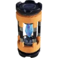 | **Clock speed.** Select a machine to set it, like the in-game panel. Power follows the game's formula. Overclocked lines keep machines at 100% and push only as many past it as needed, so they use the fewest power shards. |
|  | **Somersloops and auto place.** Set somersloops per machine, or enter how many somersloops and power shards you own and let the planner put them where they save the most. |
|  | **Extraction.** Choose the miner, node purity and extractor clock to see how many miners and pumps each resource needs, and their power. |
| 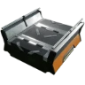 | **Two views.** The factory graph colours belts by tier and doubles up lanes when one belt can't carry the flow. Hover or tap a machine to follow its line. The table lists the total build cost of every machine and extractor. |
| 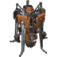 | **Anywhere.** Works offline, installs as an app, and fits phones: one pane at a time with a bottom bar, and the factory runs top to bottom. |

## Install as an app

- **Chrome, Edge (desktop), Chrome (Android):** click **Install app** in the top bar, or use the install icon in
  the address bar.
- **iPhone, iPad (Safari):** tap **Share**, then **Add to Home Screen**. The Install app button explains this.
- **Firefox (desktop):** has no install option. Use it as a normal website.

After the first visit everything is cached, including the solver and all icons. The planner then works without a
network. Updates install on their own the next time you open it, and your factories stay saved in the browser.

To make everything bigger or smaller, use the browser's zoom (Ctrl + / Ctrl −, or pinch on a touch screen).

## Development

Needs [Bun](https://bun.sh).

```sh
bun install
bun run dev        # http://localhost:1420
bun test           # solver, graph, saved state and string tests
bun run check      # Biome lint + format check (bun run format to fix)
bun run build      # type check + production bundle in dist/
bun run preview    # serve dist/ with the service worker, as it will be deployed
```

CI (GitHub Actions) runs check, test and build on every push.

The build is a static site. To serve it from a sub-folder, for example GitHub Pages at `/<repo>/`, set
`BASE_PATH`:

```sh
BASE_PATH=/ficsit_planner/ bun run build
```

On Windows, run that in PowerShell (`$env:BASE_PATH = '/ficsit_planner/'; bun run build`). Git Bash rewrites
arguments that look like Unix paths into Windows paths, so the base comes out as `/Program Files/Git/...`. Prefix
the command with `MSYS_NO_PATHCONV=1` if you want to stay in Git Bash.

### Deploying

The live site is on Cloudflare Pages. `wrangler.jsonc` names the project, and `public/_headers` sets the security
headers and long caching for the hashed files in `assets/`.

```sh
bunx wrangler login   # once, opens the browser
bun run deploy        # build, then upload dist/ to https://ficsit-planner.pages.dev
```

`SITE_URL` (default `https://ficsit-planner.pages.dev`) goes into the canonical link, the social preview tags,
`robots.txt` and `sitemap.xml`, which the build writes. Set it when you host the site somewhere else, including the
sub-folder if there is one: `SITE_URL=https://you.github.io/ficsit_planner`. The social preview image is
`public/og-image.jpg` (1200 × 630).

App icons (favicon, PWA and iOS icons) are generated from `public/logo.png` with `bun run pwa-icons`. Commit the
files it writes to `public/`.

See [CONTRIBUTING.md](CONTRIBUTING.md) for code style and what to check before a change goes in, and
[CHANGELOG.md](CHANGELOG.md) for what changed between versions.

## How the solver works

`src/lib/solver.ts` builds an LP in CPLEX text format and hands it to HiGHS, which runs in a Web Worker
(`src/lib/solver.worker.ts`) so the page never freezes.

- **Variables:** one per enabled recipe (machines running at that recipe's clock and somersloop setting), one per
  raw resource used, and one "missing" variable for every item no enabled recipe can make.
- **Constraints:** for every item, net production ≥ demand − on-hand supply. Raw resources are capped by the
  player's limit, or by the world limit when there is none.
- **Objective:** *fewer resources* minimises raw use weighted by scarcity (iron's world limit ÷ the resource's
  limit), plus a tiny machine-power term so it never builds machines it doesn't need. *Less power* minimises
  machine power, with the resource weights as a small tie-breaker. Missing items cost 10⁵ each, so they only
  appear when nothing else works.
- **Pinned inputs** are solved in two passes. The first maximises a scale factor *k* on all targets, with the
  pinned resources as hard limits. The second solves the normal objective at that *k*.
- **Shadow prices** of the item rows give the marginal raw cost of each item. Auto place uses them to send
  somersloops to the machines whose inputs are most expensive.
- **Failures** come back as codes (`infeasible`, `pinnedInfeasible`, `stopped`), and the UI shows them as text in
  the current language.

After solving, fractional machine counts are rounded up to buildings you can actually place, each with its own
clock. `src/lib/graph.ts` then matches each item's producers to its consumers greedily, largest first, which keeps
the belt count low. dagre lays the graph out left to right, or top to bottom on phones.

## Project layout

| Path | What |
| --- | --- |
| `src/lib/solver.ts` | LP model, solve, somersloop/shard auto placement |
| `src/lib/solver.worker.ts`, `solverClient.ts` | the solver in a Web Worker, and its promise API |
| `src/lib/graph.ts` | solution → nodes and belts, layout |
| `src/lib/extraction.ts` | miner and pump counts per node purity |
| `src/lib/data.ts` | typed access to the game data, belt/pipe choice per flow |
| `src/locales/en.ts`, `src/lib/lang.ts`, `src/lib/i18n.ts` | UI strings, language registry, `useT()` |
| `src/lib/install.ts`, `src/components/PwaStatus.tsx` | install button and offline status |
| `index.html`, `vite.config.ts` | page title, search and social preview tags, PWA manifest, `robots.txt` and sitemap |
| `public/_headers`, `public/404.html`, `wrangler.jsonc` | Cloudflare Pages headers, not-found page, project config |
| `src/store.ts` | app state (zustand), saved to `localStorage` |
| `src/components/` | panels, graph view, table view, inspector, phone navigation |
| `scripts/extract.mjs` | game data extractor |
| `tools/icon-extractor/` | .NET icon extractor |
| `tests/` | solver, extraction, auto placement, graph, saved state and string tests |

Saved state is versioned. After a game data refresh, recipes and items that no longer exist are dropped from
saved factories when they load.

### Adding a language

1. Copy `src/locales/en.ts` to a new file and translate the values. TypeScript flags any missing key.
2. Register it in `LANGS` in `src/lib/lang.ts`, along with its number-format locale.
3. Game item and recipe names come from the game's own translations in `CommunityResources/Docs`, so the
   extractor has to be run against an install to add them.

## Game data in this repo

| File | What | Made by |
| --- | --- | --- |
| `src/data/gamedata.json` | items, recipes, buildings, belts, extractors | `bun run extract` |
| `src/data/meta.json` | which game build the data came from | `bun run extract` |
| `src/data/icon-manifest.json` | icon texture path per item/building | `bun run extract` |
| `public/icons/*.webp` | item and building icons | `bun run icons` |

Last extract: **Satisfactory 1.2.4.0**, build 502094, Unreal Engine 5.6.1, on 2026-09-24 (see `src/data/meta.json`).

## Refreshing data after a game update (needs the game installed)

```sh
bun run extract                                            # Epic install on C: by default
bun run extract "D:/SteamLibrary/steamapps/common/Satisfactory"
bun run icons                                              # needs the .NET 10 SDK
dotnet run --project tools/icon-extractor -- "D:/SteamLibrary/steamapps/common/Satisfactory"
```

The extractor also reads the install path from the `SATISFACTORY_DIR` environment variable. `bun run icons` points
at the default Epic install. For any other location, run the `dotnet` line from the repo root.

Commit the changed files under `src/data` and `public/icons` afterwards.

- `scripts/extract.mjs` reads `CommunityResources/Docs/en-US.json` (UTF-16) plus the build `.version` file.
  Seasonal (FICSMAS) recipes are skipped.
- `tools/icon-extractor` reads the IoStore archives (`.utoc/.ucas`) with CUE4Parse and writes WebP.
  The game's `FactoryGame.usmap` writes `OptionalProperty` without an inner type, which CUE4Parse expects,
  so `UsmapPatch.cs` inserts a placeholder before loading it. The engine version is set in `Program.cs`
  (`EGame.GAME_UE5_6`). Bump it if a game update moves to a newer Unreal version.

## Notes

- World resource limits (used to weigh scarce ores) come from SatisfactoryTools. They were last compared with
  its current numbers on 2026-09-24 and were unchanged.
- Somersloop slot counts come from the game data, not the wiki. The current build gives Smelters 0 slots.

## License

The planner's code is free software under the **GNU General Public License v3.0 or later**. See
[LICENSE](LICENSE). You can use, study, change and share it. If you distribute it, changed or not, you have to
share the source under the same license.

These parts are not the project's own work, so the GPL doesn't cover them:

- **Game content.** Item and building icons (`public/icons/`) and the game data extracted into `src/data/`
  (names, recipes, numbers) belong to Coffee Stain Studios. They are included only so this free, non-commercial
  fan tool can work, and all rights to them stay with Coffee Stain. Satisfactory is a trademark of Coffee Stain
  Studios. This project is not affiliated with or endorsed by them.
- **Dependencies** keep their own licenses. HiGHS, React, React Flow, dagre, zustand and Workbox are MIT. The
  Barlow fonts are SIL Open Font License 1.1. CUE4Parse, which the icon extractor uses, is Apache-2.0. All of
  them can be combined with GPLv3.
- **World resource limits** come from [SatisfactoryTools](https://github.com/greeny/SatisfactoryTools), MIT.
