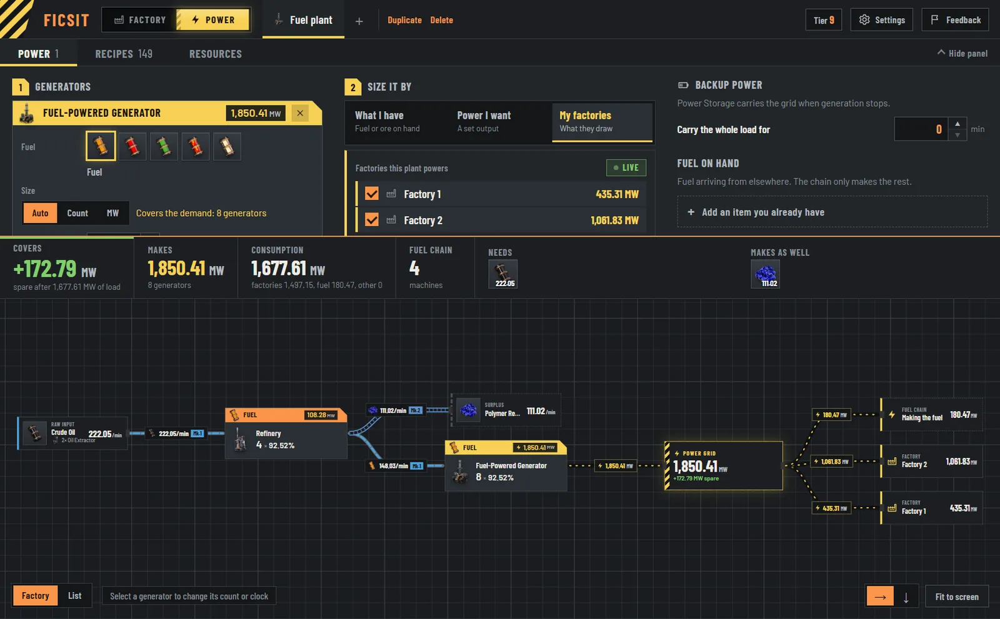
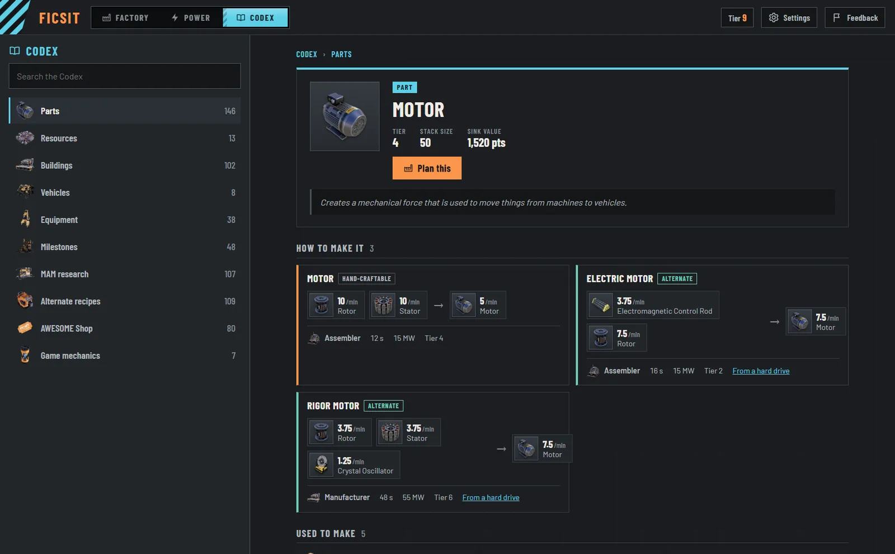
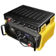

<p align="center">
  
</p>

<h1 align="center">FICSIT Planner</h1>

<p align="center">
  <a href="https://github.com/Albis0/ficsit_planner/actions/workflows/ci.yml"></a>
  <a href="LICENSE"></a>
</p>

<p align="center"><b><a href="https://ficsit-planner.pages.dev">Open FICSIT Planner → ficsit-planner.pages.dev</a></b></p>

<p align="center">
  
  
  
  
  
  
  
  
  
  
  
  
</p>

Production planner for Satisfactory that runs in the browser and works offline. Pick what you want to make
and how many per minute. A linear programming solver ([HiGHS](https://highs.dev), compiled to WebAssembly)
picks the recipes, counts the machines, sets their clock speeds and draws the factory as belts and pipes.
Switch to the power planner and plan power plants the same way: from the fuel you have, for the MW you want,
or for the factories they run, fuel chain included. Or open the Codex and look up anything in the game: every
part, building, vehicle, milestone, research and alternate recipe, with calculators for the mechanics.

It's a static site you can install as an app (a PWA). Chrome, Edge and Android add a desktop or home-screen
shortcut, and iPhone and iPad do the same through the Share menu. Once installed it opens in its own window
and works without a network. There's nothing to download and run. It works on phones and tablets too.






<p align="center">
  
  
  
</p>

## Features

| | |
| :-: | --- |
|  | **Targets and factories.** Add as many products per factory as you want, each at its own rate. Factories live in tabs you can rename, duplicate and delete. Everything is saved in the browser. |
|  | **On-hand items.** Parts that arrive from another factory or by train. The planner uses them instead of building them from scratch. |
|  | **Recipe control.** Standard, alternate and converter recipes are grouped by product, and each one can be switched on or off. If something can't be made, the planner says why (the tier that unlocks it, or the recipe that's off) and offers the fix in one click, or to bring it in as on hand. |
|  | **Knows your progress.** On first launch you pick the highest milestone tier you've unlocked. Recipes, buildings, belts, pipes and miners above that tier stay out of the plan until you raise it. |
|  | **Start anywhere.** The first screen is one question: what are we making? Search every item, or start from the Space Elevator parts and common parts. Items above your tier show the tier that unlocks them. |
|  | **Resource limits.** Set a per-minute cap for each raw resource. Leave it empty to use the whole world's supply. |
|  | **Pinned inputs.** Type what you actually have into a raw input in the summary strip (or step it up and down), or click the rate on an ore node in the graph. Every target scales to what that input can feed and keeps its ratio. |
|  | **Machines and clock speed.** Select a machine and set how many to build, or the clock speed: the other follows, so the work is spread evenly and the clock you see is the clock they run at. Power follows the game's formula. Overclocked lines keep machines at 100% and push only as many past it as needed, so they use the fewest power shards. |
|  | **Somersloops and auto place.** Set somersloops per machine, or enter how many somersloops and power shards you own and let the planner put them where they save the most. |
|  | **Extraction.** Choose the miner, node purity and extractor clock to see how many miners and pumps each resource needs, and their power. |
|  | **Two views.** The factory graph lays itself out left to right or top to bottom, whichever fits your screen better (or pick one), routes belts around machines, colours them by tier and doubles up lanes when one belt can't carry the flow. The panel sits across the top and the graph gets the full width under it, or beside it if you prefer (Settings). Each machine card has the game's build-menu look: a coloured strip with the product and its power draw, the building underneath with its name, count and clock. Machines holding power shards get a blue edge, somersloops a pink one. Hover or tap a machine to follow its line. The table lists the total build cost of every machine and extractor. |
|  | **Power planner.** Flip the switch in the top bar from Factory to Power. Each power plant is a tab of its own, like a factory, and can mix generators: biomass, coal, fuel, nuclear, geothermal and the Alien Power Augmenter, each with its fuel. Size a plant three ways: **What I have** (list the fuel, or the ore and oil it's made from, and it makes all it can), **Power I want** (a set MW), or **My factories** (tick the factory tabs it runs, add trains and lights and some spare; it follows them as they change). Each factory is counted on one plant only. **Auto** generators are sized to fit, including the power the plant's own fuel chain uses, which the planner builds and draws like any factory: ore to fuel to generators to the grid to your factories. Generators can also be a set count or a set output, at any clock. Water, nuclear waste (and the plutonium chain that uses it), augmenter boost and backup Power Storage are all counted. |
|  | **Codex.** The third stop on the switch. Every part, resource, building, vehicle, piece of equipment, HUB milestone, MAM research, alternate recipe and AWESOME Shop offer, with the game's own descriptions. A part's page shows every way to make it, what it goes into and builds, what it's delivered for and what burns it; a building's page its cost, unlock, power and recipes; an alternate is compared with the standard recipe. Game mechanics (clock speed, somersloops, nodes, fuel, belts, world resources, sink points) come with calculators. Search everything, follow any link, share a page by its address, and press **Build this factory** (or **Build with this recipe** on any recipe) to open a factory for it in a new tab. |
|  | **Share by link.** **Share** copies a link to the factory on screen with the power plants that run it (or to a plant with its factories). Whoever opens it gets a copy as a new tab. The factory rides inside the link, so nothing is uploaded and it opens offline too. |
|  | **Settings.** Put the panel on top, left or right. Set the card size, text size and spacing on the factory floor, belt labels, moving belts and the foundation grid, the accent and recipe colours, the interface size, decimals and animations, all with a live preview. Save all your factories and settings to a file, and load them back. **Help** explains every term on screen. |
|  | **Feedback.** Report a bug or suggest an idea from inside the app. It goes to the site's own database, optionally with the factory you're looking at, and nothing else is collected. |
|  | **Anywhere.** Works offline, installs as an app, and fits phones: one pane at a time with a bottom bar, and the factory runs top to bottom. |

## Install as an app

- **Chrome, Edge (desktop), Chrome (Android):** click **Install app** in the top bar, or use the install icon in
  the address bar.
- **iPhone, iPad (Safari):** tap **Share**, then **Add to Home Screen**. The Install app button explains this.
- **Firefox (desktop):** has no install option. Use it as a normal website.

After the first visit everything is cached, including the solver and all icons. The planner then works without a
network. Updates install on their own the next time you open it, and your factories stay saved in the browser.

To make the cards or the interface bigger or smaller, open **Settings** (top right). The browser's zoom (Ctrl + /
Ctrl −, or pinch on a touch screen) works too. On a desktop, drag the panel's edge to resize it (double-click the
edge to reset it), or click **Hide panel** to give the factory the whole screen. Amounts have up and down buttons
(and the arrow keys) that move them one whole number at a time.

## Development

Needs [Bun](https://bun.sh).

```sh
bun install
bun run dev        # http://localhost:1420
bun test           # solver, graph, saved state and string tests
bun run check      # Biome lint + format check (bun run format to fix)
bun run build      # type check + production bundle in dist/
bun run preview    # serve dist/ with the service worker, as it will be deployed
```

CI (GitHub Actions) runs check, test and build on every push.

The build is a static site. To serve it from a sub-folder, for example GitHub Pages at `/<repo>/`, set
`BASE_PATH`:

```sh
BASE_PATH=/ficsit_planner/ bun run build
```

On Windows, run that in PowerShell (`$env:BASE_PATH = '/ficsit_planner/'; bun run build`). Git Bash rewrites
arguments that look like Unix paths into Windows paths, so the base comes out as `/Program Files/Git/...`. Prefix
the command with `MSYS_NO_PATHCONV=1` if you want to stay in Git Bash.

### Deploying

The live site is on Cloudflare Pages. `wrangler.jsonc` names the project and its feedback database, and
`public/_headers` sets the security headers and long caching for the hashed files in `assets/`.

```sh
bunx wrangler login   # once, opens the browser
bun run deploy        # build, then upload dist/ and functions/ to https://ficsit-planner.pages.dev
```

### Feedback from players

The in-app **Feedback** window posts to `functions/api/report.ts`, a Pages Function that stores each report in a
D1 database (`ficsit-reports`, schema in `migrations/`). It checks the fields, turns away other sites, drops bots
that fill a hidden field, strips control characters, and allows six reports an hour per sender. Senders are kept for
an hour as a salted hash for that limit and never with a report. Read the reports from your machine:

```sh
bun run reports            # open reports, newest first
bun run reports show 12    # one in full, with the factory it came with
bun run reports done 12    # mark it handled
bun run reports md         # write the open ones to reports/feedback.md
bun run db:migrate         # apply a new schema file in migrations/ to the live database
```

Add `--local` to any of them to read the database `bunx wrangler pages dev dist` uses instead. The salt is the
`REPORT_SALT` secret on the Pages project. See [docs/feedback.md](docs/feedback.md) for the details.

`SITE_URL` (default `https://ficsit-planner.pages.dev`) goes into the canonical link, the social preview tags,
`robots.txt` and `sitemap.xml`, which the build writes. Set it when you host the site somewhere else, including the
sub-folder if there is one: `SITE_URL=https://you.github.io/ficsit_planner`. The social preview image is
`public/og-image.jpg` (1200 × 630).

App icons (favicon, PWA and iOS icons) are generated from `public/logo.png` with `bun run pwa-icons`. Commit the
files it writes to `public/`.

See [CONTRIBUTING.md](CONTRIBUTING.md) for code style and what to check before a change goes in, and
[CHANGELOG.md](CHANGELOG.md) for what changed between versions.

## How the solver works

`src/lib/solver.ts` builds an LP in CPLEX text format and hands it to HiGHS, which runs in a Web Worker
(`src/lib/solver.worker.ts`) so the page never freezes.

- **Variables:** one per enabled recipe (machines running at that recipe's clock and somersloop setting), one per
  raw resource used, and one "missing" variable for every item no enabled recipe can make.
- **Constraints:** for every item, net production ≥ demand − on-hand supply. Raw resources are capped by the
  player's limit, or by the world limit when there is none.
- **Objective:** minimise raw use weighted by scarcity (iron's world limit ÷ the resource's limit), plus a tiny
  machine-power term so it never builds machines it doesn't need. Missing items cost 10⁵ each, so they only appear
  when nothing else works. The solver can also minimise power instead; the app doesn't offer it, because with
  standard recipes both goals nearly always pick the same factory.
- **Power plants** join the model as stand-in recipes: one "machine" is one generator at its clock, taking its
  fuel and water and leaving its waste, so the fuel chain is solved like any factory. When a plant is set to Auto,
  one more row says generation (times the augmenter boost) must cover the outside demand plus every machine and
  extractor in the plan, with the spare capacity on top. Fixed plants are pinned to their count or output.
- **Pinned inputs** are solved in two passes. The first maximises a scale factor *k* on all targets, with the
  pinned resources as hard limits. The second solves the normal objective at that *k*.
- **Shadow prices** of the item rows give the marginal raw cost of each item. Auto place uses them to send
  somersloops to the machines whose inputs are most expensive.
- **Failures** come back as codes (`infeasible`, `pinnedInfeasible`, `stopped`), and the UI shows them as text in
  the current language.

After solving, fractional machine counts are rounded up to buildings you can actually place, each with its own
clock. `src/lib/graph.ts` then matches each item's producers to its consumers greedily, largest first, which keeps
the belt count low. dagre lays the graph out left to right, or top to bottom on phones.

## Project layout

| Path | What |
| --- | --- |
| `src/lib/solver.ts` | LP model, solve, somersloop/shard auto placement |
| `src/lib/solver.worker.ts`, `solverClient.ts` | the solver in a Web Worker, and its promise API |
| `src/lib/graph.ts` | solution → nodes and belts; layout tries both directions and three rankings, keeps the one that fits the screen with the fewest crossings, and routes belts through space kept for their labels |
| `src/lib/extraction.ts` | miner and pump counts per node purity, and their MW per unit for the power planner |
| `src/lib/power.ts`, `src/lib/solution.ts` | generators as solver recipes, and the hooks that solve factories and power plants |
| `src/lib/settings.ts`, `src/lib/backup.ts` | settings and the CSS variables they set; save and load a copy |
| `src/lib/feedback.ts`, `src/lib/feedback-schema.ts`, `functions/api/report.ts` | the feedback window's request, its checks, and the endpoint that stores it |
| `src/lib/codex.ts`, `src/components/Codex.tsx`, `CodexGuides.tsx` | the Codex: its data, index and search, pages and addresses, and the game-mechanics guides |
| `src/lib/data.ts` | typed access to the game data, belt/pipe choice per flow, unlock tiers and why an item can't be made |
| `src/locales/en.ts`, `src/lib/lang.ts`, `src/lib/i18n.ts` | UI strings, language registry, `useT()` |
| `src/lib/install.ts`, `src/components/PwaStatus.tsx` | install button and offline status |
| `index.html`, `vite.config.ts` | page title, search and social preview tags, PWA manifest, `robots.txt` and sitemap |
| `public/_headers`, `public/404.html`, `wrangler.jsonc` | Cloudflare Pages headers, not-found page, project config |
| `src/store.ts` | app state (zustand), saved to `localStorage` |
| `src/components/` | panels, graph view, table view, inspector, power panel and floor, mode switch, settings and feedback windows, phone navigation, panel splitter |
| `migrations/`, `scripts/reports.mjs` | feedback database schema, and reading the reports |
| `scripts/extract.mjs`, `scripts/extract-codex.mjs` | game data extractors: the planner's data, and the Codex's |
| `tools/icon-extractor/` | .NET icon extractor |
| `tests/` | solver, extraction, auto placement, graph layout, unlock tiers, saved state and string tests |
| `docs/manual-test.md` | a click-through checklist for testing the app by hand before a release |

Saved state is versioned. After a game data refresh, recipes and items that no longer exist are dropped from
saved factories when they load.

### Adding a language

1. Copy `src/locales/en.ts` to a new file and translate the values. TypeScript flags any missing key.
2. Register it in `LANGS` in `src/lib/lang.ts`, along with its number-format locale.
3. Game item and recipe names come from the game's own translations in `CommunityResources/Docs`, so the
   extractor has to be run against an install to add them.

## Game data in this repo

| File | What | Made by |
| --- | --- | --- |
| `src/data/gamedata.json` | items, recipes, buildings, belts, extractors, generators and fuel energy | `bun run extract` |
| `src/data/meta.json` | which game build the data came from | `bun run extract` |
| `src/data/icon-manifest.json` | icon texture path per item/building | `bun run extract` |
| `src/data/codex.json` | descriptions, stack sizes, every building, vehicles, equipment, milestones, MAM research, the AWESOME Shop (loaded when the Codex opens) | `bun run extract:codex` |
| `src/data/codex-icons.json` | icon texture paths the Codex needs on top of the planner's | `bun run extract:codex` |
| `public/icons/*.webp` | item and building icons | `bun run icons`, `bun run icons:codex` |

Last extract: **Satisfactory 1.2.4.0**, build 502094, Unreal Engine 5.6.1, on 2026-09-24 (see `src/data/meta.json`).

## Refreshing data after a game update (needs the game installed)

```sh
bun run extract                                            # Epic install on C: by default
bun run extract "D:/SteamLibrary/steamapps/common/Satisfactory"
bun run extract:codex                                      # after extract: it reads gamedata.json
bun run icons                                              # needs the .NET 10 SDK
bun run icons:codex
dotnet run --project tools/icon-extractor -- "D:/SteamLibrary/steamapps/common/Satisfactory"
```

The extractor also reads the install path from the `SATISFACTORY_DIR` environment variable. `bun run icons` points
at the default Epic install. For any other location, run the `dotnet` line from the repo root.

Commit the changed files under `src/data` and `public/icons` afterwards.

- `scripts/extract.mjs` reads `CommunityResources/Docs/en-US.json` (UTF-16) plus the build `.version` file.
  Seasonal (FICSMAS) recipes are skipped. `scripts/extract-codex.mjs` reads the same file for the Codex.
  Coupons and hard drives have no descriptor there, so their names and icon paths are set in the script.
- `tools/icon-extractor` reads the IoStore archives (`.utoc/.ucas`) with CUE4Parse and writes WebP.
  The game's `FactoryGame.usmap` writes `OptionalProperty` without an inner type, which CUE4Parse expects,
  so `UsmapPatch.cs` inserts a placeholder before loading it. The engine version is set in `Program.cs`
  (`EGame.GAME_UE5_6`). Bump it if a game update moves to a newer Unreal version. Pass `--find <text>` in place
  of the manifest to list archive paths containing that text, to look up an icon by hand.

## Notes

- World resource limits (used to weigh scarce ores) come from SatisfactoryTools. They were last compared with
  its current numbers on 2026-09-24 and were unchanged.
- Somersloop slot counts come from the game data, not the wiki. The current build gives Smelters 0 slots.

## License

The planner's code is free software under the **GNU General Public License v3.0 or later**. See
[LICENSE](LICENSE). You can use, study, change and share it. If you distribute it, changed or not, you have to
share the source under the same license.

These parts are not the project's own work, so the GPL doesn't cover them:

- **Game content.** Item and building icons (`public/icons/`) and the game data extracted into `src/data/`
  (names, recipes, numbers) belong to Coffee Stain Studios. They are included only so this free, non-commercial
  fan tool can work, and all rights to them stay with Coffee Stain. Satisfactory is a trademark of Coffee Stain
  Studios. This project is not affiliated with or endorsed by them.
- **Dependencies** keep their own licenses. HiGHS, React, React Flow, dagre, zustand and Workbox are MIT. The
  Barlow fonts are SIL Open Font License 1.1. CUE4Parse, which the icon extractor uses, is Apache-2.0. All of
  them can be combined with GPLv3.
- **World resource limits** come from [SatisfactoryTools](https://github.com/greeny/SatisfactoryTools), MIT.
