<p align="center">
  
</p>

<h1 align="center">FICSIT Planner</h1>

<p align="center">
  <a href="https://github.com/Albis0/ficsit_planner/actions/workflows/ci.yml"></a>
  <a href="LICENSE"></a>
</p>

<p align="center"><b><a href="https://ficsitplanner.app">Open FICSIT Planner → ficsitplanner.app</a></b></p>

<p align="center">
  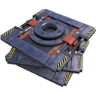
  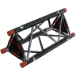
  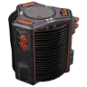
  
  
  
  
  
  
  
  
  
</p>

Production planner for Satisfactory that runs in the browser. Enter what you want per minute and it picks the
recipes, counts the machines, sets their clock speeds and draws the factory with its belts and pipes. The maths is
done by a linear programming solver ([HiGHS](https://highs.dev), compiled to WebAssembly).

It also plans power plants and their fuel, has a Codex with the game's parts, buildings, milestones, research and
alternate recipes, and a map of every resource node. It can be installed as an app (PWA) and then works offline.

Coded with AI. What changed lately is under **Settings › Updates** in the app, and in [CHANGELOG.md](CHANGELOG.md).

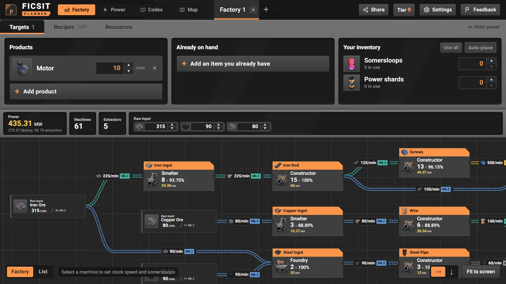

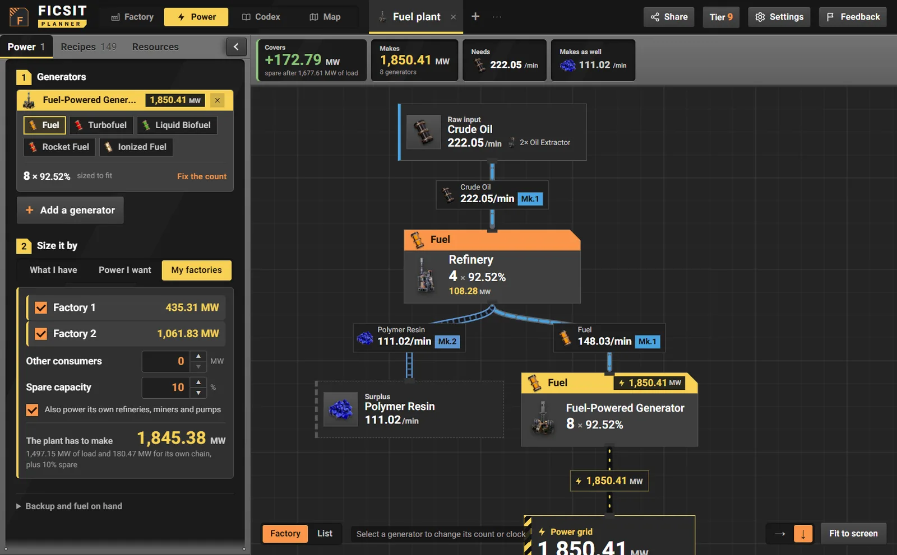

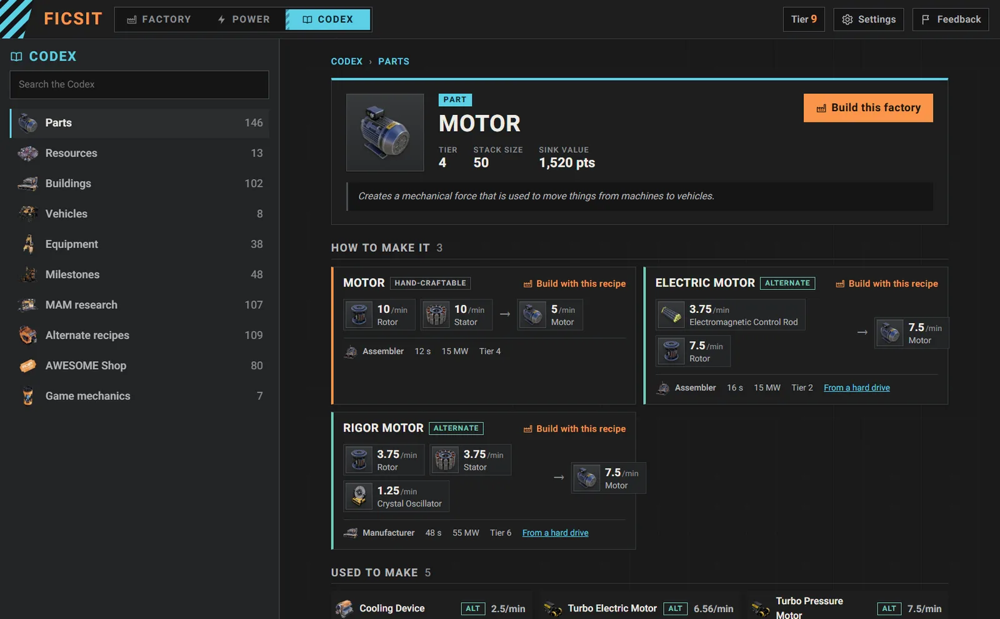

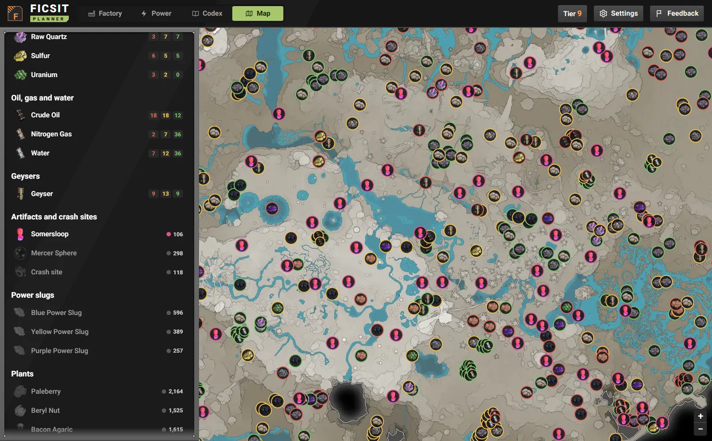

<p align="center">
  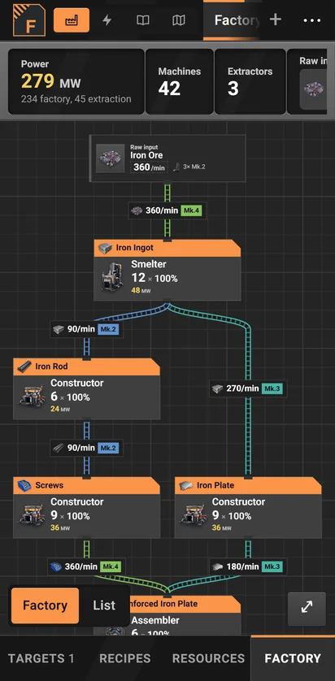
  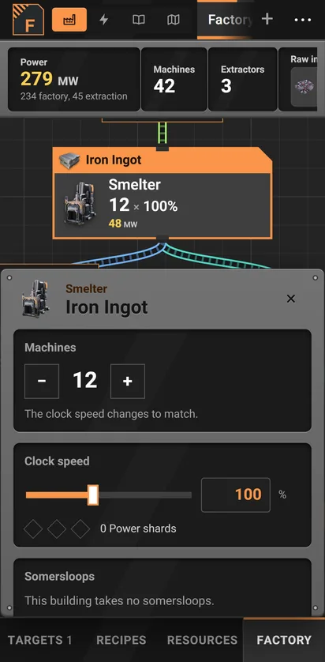
  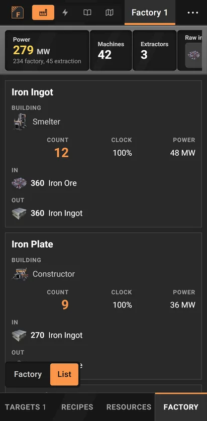
</p>

## Features

- 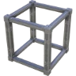 **Targets and tabs.** Any number of products per factory, each at its own rate. Factories are tabs you can rename, duplicate and delete. Everything is saved in the browser.
-  **On-hand items.** Parts that arrive from elsewhere (another factory, a train). The planner uses them instead of making them.
- 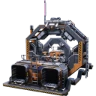 **Recipes.** Standard, alternate and converter recipes, grouped by product, each one on or off, with a search at the top. Selecting a machine lists the other recipes for what it makes, to tick from there. When something can't be made, the planner says why (the tier that unlocks it, or the recipe that's off) and offers the fix.
-  **Tier.** You pick the highest tier you've unlocked. Recipes, buildings, belts and miners above it are left out and hidden from the recipe list. An alternate also waits for the tier that makes its parts.
-  **Resource limits and what to optimize.** A per-minute cap for each raw resource; empty means the whole map's supply. The plan spares scarce resources first, or, with **All equal**, counts every resource the same (for mods that let you build nodes anywhere), or, with **Fewest buildings**, needs as few buildings as it can, miners and pumps included, without mining more kinds of raw resource than it has to.
-  **Pinned inputs.** Type the amount of a raw resource you actually have into the totals strip, and the targets scale to it. If that keeps a ticked alternate out of the plan, the planner names it.
- 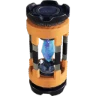 **Machines and clocks.** Select a machine to set how many there are or their clock speed. Power uses the game's formula. Overclocked lines use as few power shards as possible.
-  **Somersloops and shards.** Set them per machine, or enter how many you own and let the planner place them (**Auto place** or **Use all**).
-  **Extraction.** Miner mark, node purity and extractor clock decide how many miners and pumps each resource needs, and their power. Enter the nodes you actually have (say one pure and one impure) and extractors go on the best of them first.
- 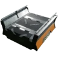 **Graph and list.** The graph runs left to right or top to bottom, colours belts by tier and splits a flow over more belts when one isn't enough. A line whose belts or pipes would overflow says how to build it in groups (6 + 4 blenders, say), and a line whose output goes to more than one place is drawn as a card per place, each at its own clock (3 × 81.72% for the rods, 2 × 77.42% for the plates), so there's no splitter ratio to work out; Settings can keep it as one card. **Fit to screen** shows even the biggest factory whole. The list shows every recipe and the build cost; pointing at a line lights up where its inputs come from and where its outputs go. The totals over the floor fold away to one line.
- 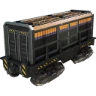 **Transport.** The third view lists everything a factory takes in and sends out. Pick a belt or pipe, a train, a truck, a tractor, an explorer, a fluid truck or a drone for each, type how far it goes, and see how many vehicles, stations and platforms it takes, the round trip, the power and the fuel or batteries. Trains follow the wiki's train throughput formula; trip times rest on top speeds and are marked as estimates. The same calculator is in the Codex.
-  **Power planner.** Power plants are tabs too and can mix generators. Size one by the fuel you have, the MW you want or the factories it runs. The fuel chain, water, nuclear waste, augmenters and Power Storage are counted.
-  **Codex.** Parts, resources, buildings, vehicles, equipment, milestones, MAM research, alternate recipes and the AWESOME Shop, with the game's descriptions, plus creatures, world finds and crash sites. Every part shows its whole production line and how each of its recipes compares; every alternate is ranked against the standard recipe. Guides cover getting started, the Space Elevator, power, oil and nuclear. **Build this factory** opens a factory for any part.
-  **World map.** All 459 resource nodes, 118 well nodes and 31 geysers on the game's map, filtered by resource and purity. Pressing a node shows what each miner or extractor gets from it. Somersloops, Mercer Spheres, power slugs, crash sites, plants and creature spawns can be turned on too.
-  **Linked factories.** A factory can take an item from another factory tab, which then makes it on top of its own products.
- 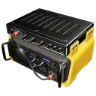 **Share links.** The **Share** button copies a link that contains the factory (and the power plants that run it). Opening it adds a copy as a new tab. Nothing is uploaded.
-  **Settings.** Panel position, card and text size, spacing, belt labels, colours, interface size, decimals and animations. **Game settings** take your save's part cost, power use and Space Elevator multipliers. Save all factories and settings to a file and load them back. **Help** explains the terms on screen, **Updates** lists what changed.
-  **Feedback.** Bug reports and ideas from inside the app, optionally with the factory on screen.
- 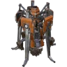 **Phones and offline.** Installs as an app and works offline. On phones there is one pane at a time and a bottom bar.

## Install as an app

- **Chrome, Edge (desktop), Chrome (Android):** click **Install app** in the top bar, or use the install icon in
  the address bar.
- **iPhone, iPad (Safari):** tap **Share**, then **Add to Home Screen**. The Install app button explains this.
- **Firefox (desktop):** has no install option. Use it as a normal website.

After the first visit everything is cached, including the solver and all icons. The planner then works without a
network. Updates install on their own the next time you open it, and your factories stay saved in the browser.

To make the cards or the interface bigger or smaller, open **Settings** (top right). The browser's zoom (Ctrl + /
Ctrl −, or pinch on a touch screen) works too. On a desktop, drag the panel's edge to resize it (double-click the
edge to reset it), or click **Hide panel** to give the factory the whole screen. Amounts have up and down buttons
(and the arrow keys) that move them one whole number at a time.

## Development

Needs [Bun](https://bun.sh).

```sh
bun install
bun run dev        # http://localhost:1420
bun test           # solver, hand-checked numbers, random plans, graph, saved state and strings
bun run check      # Biome lint + format check (bun run format to fix)
bun run build      # type check + production bundle in dist/
bun run preview    # serve dist/ with the service worker, as it will be deployed
bun run sweep      # every screen at five window sizes, checked for layout problems (see CONTRIBUTING)
bun run visual     # screenshots of 28 screens compared with e2e/baseline
```

CI (GitHub Actions) runs check, test and build on every push, then a sample of every screen in Chromium, WebKit
and Firefox.

The build is a static site. To serve it from a sub-folder, for example GitHub Pages at `/<repo>/`, set
`BASE_PATH`:

```sh
BASE_PATH=/ficsit_planner/ bun run build
```

On Windows, run that in PowerShell (`$env:BASE_PATH = '/ficsit_planner/'; bun run build`). Git Bash rewrites
arguments that look like Unix paths into Windows paths, so the base comes out as `/Program Files/Git/...`. Prefix
the command with `MSYS_NO_PATHCONV=1` if you want to stay in Git Bash.

### Hosting your own copy

The build in `dist/` is a static site and runs on any static host. Only the in-app **Feedback** form needs a server:
on [ficsitplanner.app](https://ficsitplanner.app) it posts to a Cloudflare Pages Function with a D1
database (`functions/api/report.ts`, schema in `migrations/`). Without it the form offers to post the report as a GitHub
issue instead. [docs/feedback.md](docs/feedback.md) covers what a report holds, how it's checked and stored, and
the setup on Cloudflare.

`SITE_URL` (default `https://ficsitplanner.app`) goes into the canonical link, the social preview tags,
`robots.txt` and `sitemap.xml`, which the build writes. Set it when you host the site somewhere else, including the
sub-folder if there is one: `SITE_URL=https://you.github.io/ficsit_planner`. The social preview image is
`public/og-image.jpg` (1200 × 630).

App icons (favicon, PWA and iOS icons) are generated from `public/logo.png` with `bun run pwa-icons`. Commit the
files it writes to `public/`.

See [CONTRIBUTING.md](CONTRIBUTING.md) for code style and what to check before a change goes in, and
[CHANGELOG.md](CHANGELOG.md) for what changed between versions.

## How the solver works

`src/lib/solver.ts` builds an LP in CPLEX text format and hands it to HiGHS, which runs in a Web Worker
(`src/lib/solver.worker.ts`) so the page never freezes.

- **Variables:** one per enabled recipe (machines running at that recipe's clock and somersloop setting), one per
  raw resource used, and one "missing" variable for every item no enabled recipe can make.
- **Constraints:** for every item, net production ≥ demand − on-hand supply. Raw resources are capped by the
  player's limit, or by the world limit when there is none.
- **Objective:** minimise raw use weighted by scarcity (iron's world limit ÷ the resource's limit; with **All
  equal** every resource but water weighs 1), plus a tiny
  machine-power term so it never builds machines it doesn't need. With **Fewest buildings** each machine costs 1
  instead, and each unit of raw resource costs the miners or pumps it takes; a count in fractions spreads the plan
  over many recipes running a sliver each, so the worker then drops recipes smallest line first, keeping each drop
  that needs no more buildings. Counting buildings alone, a plan mines whatever saves half a machine, so a second
  plan is weighed too: a small integer search with one yes/no per limited raw resource, each kind costing 2
  buildings, picks the kinds worth mining (ore swaps in the converter left out, unless the plan can't do without
  them), and the plan is solved and tidied again with only those. Whichever needs fewer buildings with the kinds
  counted the same way wins. Missing items cost 10⁵ each, so they only appear
  when nothing else works. The solver can also minimise power instead; the app doesn't offer it, because with
  standard recipes both goals nearly always pick the same factory.
- **Power plants** join the model as stand-in recipes: one "machine" is one generator at its clock, taking its
  fuel and water and leaving its waste, so the fuel chain is solved like any factory. When a plant is set to Auto,
  one more row says generation (times the augmenter boost) must cover the outside demand plus every machine and
  extractor in the plan, with the spare capacity on top. Fixed plants are pinned to their count or output.
- **Pinned inputs** are solved in two passes, after one without the pins. The first maximises a scale factor *k*
  on all targets, with the pinned resources as hard limits and every other raw resource held to *k* times what the
  plan without pins uses of it, so a pin isn't swapped for a resource nobody pinned. The second solves the normal
  objective at that *k*. A last solve, the same output without the pins, finds the ticked alternates the pins keep
  out, so the app can name them.
- **Shadow prices** of the item rows give the marginal raw cost of each item. Auto place uses them to send
  somersloops to the machines whose inputs are most expensive.
- **Game settings** change the recipes before the model is built (`src/lib/game.ts`): solid inputs are multiplied
  per craft and rounded half up to whole items (never below one), fluids are multiplied as they are, and recipes that
  take or make packaged fluids keep their numbers. Power use multiplies what machines and extractors draw. The worker
  applies the same multipliers to its own copy of the data with every request.
- **Failures** come back as codes (`infeasible`, `pinnedInfeasible`, `stopped`), and the UI shows them as text in
  the current language.

After solving, fractional machine counts are rounded up to buildings you can actually place, each with its own
clock. `src/lib/graph.ts` then matches each item's producers to its consumers greedily, largest first, which keeps
the belt count low. dagre lays the graph out left to right, or top to bottom on phones.

## Project layout

| Path | What |
| --- | --- |
| `src/lib/solver.ts` | LP model, solve, somersloop/shard auto placement |
| `src/lib/solver.worker.ts`, `solverClient.ts` | the solver in a Web Worker, and its promise API |
| `src/lib/graph.ts` | solution → nodes and belts; layout tries both directions and three rankings, keeps the one that fits the screen with the fewest crossings, and routes belts through space kept for their labels |
| `src/lib/extraction.ts` | miner and pump counts per node purity (or on the player's own nodes), and their MW per unit for the power planner |
| `src/lib/groups.ts` | how to split a line into groups whose belts and pipes each fit |
| `src/lib/split.ts` | who sends what to whom (the graph's belts), and a line split into one group per destination |
| `src/lib/transport.ts` | vehicles, stations and trips for moving an item: freight cars by the wiki's train throughput formula, road vehicles and drones by capacity and round trip; the few numbers the game files lack sit at the top with their source |
| `src/lib/game.ts` | the save's part cost, power and Space Elevator multipliers |
| `src/lib/power.ts`, `src/lib/solution.ts` | generators as solver recipes, and the hooks that solve factories and power plants |
| `src/lib/settings.ts`, `src/lib/backup.ts` | settings and the CSS variables they set; save and load a copy |
| `src/lib/feedback.ts`, `src/lib/feedback-schema.ts`, `functions/api/report.ts` | the feedback window's request, its checks, and the endpoint that stores it |
| `src/lib/codex.ts`, `src/components/Codex.tsx`, `CodexGuides.tsx`, `CodexLine.tsx` | the Codex: its data, index and search, pages and addresses, the guides, and the production lines and recipe comparisons |
| `src/lib/insights.ts`, `scripts/codex-insights.ts` | works out each part's whole production line, its recipes compared and every fuel's cost, with the solver |
| `src/locales/codex-notes.en.ts` | the Codex's Good to know notes on parts and buildings |
| `src/locales/updates.en.ts` | the short notes under Settings › Updates (the long version is `CHANGELOG.md`) |
| `src/lib/data.ts` | typed access to the game data, belt/pipe choice per flow, unlock tiers and why an item can't be made |
| `src/locales/en.ts`, `src/lib/lang.ts`, `src/lib/i18n.ts` | UI strings, language registry, `useT()` |
| `src/lib/install.ts`, `src/components/PwaStatus.tsx` | install button and offline status |
| `index.html`, `vite.config.ts` | page title, search and social preview tags, PWA manifest, `robots.txt` and sitemap |
| `public/_headers`, `public/404.html`, `wrangler.jsonc` | Cloudflare Pages headers, not-found page, project config |
| `src/store.ts` | app state (zustand), saved to `localStorage` |
| `src/components/` | panels, graph view, table view, inspector, power panel and floor, mode switch, settings and feedback windows, phone navigation, panel splitter |
| `src/lib/slide.ts` | the highlight gliding between picks in tabs and segmented buttons |
| `scripts/deploy.mjs` | checks, tests and builds, then uploads to a preview address or the live site |
| `migrations/`, `scripts/reports.mjs` | feedback database schema, and reading the reports |
| `scripts/extract.mjs`, `scripts/extract-codex.mjs` | game data extractors: the planner's data, and the Codex's |
| `tools/icon-extractor/` | .NET icon extractor |
| `tools/map-extractor/`, `scripts/extract-map.mjs` | .NET world reader (resource nodes, the map picture) and the script that tiles the map |
| `src/lib/world.ts`, `src/components/WorldMap.tsx`, `src/components/MapNav.tsx` | the world map: node data, the map (Leaflet), its filter |
| `tests/` | solver, hand-checked production lines (`golden`), random plans (`fuzz`), extraction and your own nodes, build groups, split by destination, game multipliers, auto placement, graph layout, unlock tiers, Codex insights, saved state (with a 0.12 save that every later version must still load, `fixtures/`), feedback bans and string tests |
| `e2e/` | the screen sweep (`sweep.mjs`, `checks.js`) and the screenshot comparison (`visual.mjs`, `baseline/`) |
| `docs/manual-test.md` | a click-through checklist for testing the app by hand before a release |

Saved state is versioned. After a game data refresh, recipes and items that no longer exist are dropped from
saved factories when they load.

### Adding a language

1. Copy `src/locales/en.ts` to a new file and translate the values. TypeScript flags any missing key.
2. Register it in `LANGS` in `src/lib/lang.ts`, along with its number-format locale.
3. Game item and recipe names come from the game's own translations in `CommunityResources/Docs`, so the
   extractor has to be run against an install to add them.

## Game data in this repo

| File | What | Made by |
| --- | --- | --- |
| `src/data/gamedata.json` | items, recipes, buildings, belts, extractors, generators and fuel energy | `bun run extract` |
| `src/data/meta.json` | which game build the data came from | `bun run extract` |
| `src/data/icon-manifest.json` | icon texture path per item/building | `bun run extract` |
| `src/data/codex.json` | descriptions, stack sizes, every building, vehicles, equipment, milestones, MAM research, the AWESOME Shop (loaded when the Codex opens) | `bun run extract:codex` |
| `src/data/codex-icons.json` | icon texture paths the Codex needs on top of the planner's | `bun run extract:codex` |
| `src/data/elevator.json` | the Space Elevator's phases: what each asks for and the tiers it opens | `bun run extract:elevator` |
| `src/data/insights.json` | each part's production line, its recipes compared, and every fuel's cost, worked out with the solver | `bun run insights` |
| `public/icons/*.webp` | item and building icons | `bun run icons`, `bun run icons:codex` |
| `src/data/world.json` | every resource node, well node and geyser: resource, purity, place on the map | `bun run extract:map` |
| `public/map/{z}/{x}/{y}.webp` | the game's map picture (8192 px) as 256 px tiles, zoom 0 to 5 | `bun run extract:map` |
| `src/data/finds.json` | somersloops, Mercer Spheres, power slugs, crash sites (with what opens them), plants and creature spawns on the map | `bun run extract:world` |
| `src/data/creatures.json` | each creature's name, description, health, speed and remains, and how many of everything the world holds | `bun run extract:world` |
| `src/data/world-icons.json`, `public/icons/Desc_Hog*.webp` … | creature icons and the textures they come from | `bun run extract:world`, `bun run icons:world` |

Last extract: **Satisfactory 1.2.4.0**, build 502094, Unreal Engine 5.6.1, on 2026-09-24 (see `src/data/meta.json`).

## Refreshing data after a game update (needs the game installed)

```sh
bun run extract                                            # Epic install on C: by default
bun run extract "D:/SteamLibrary/steamapps/common/Satisfactory"
bun run extract:codex                                      # after extract: it reads gamedata.json
bun run icons                                              # needs the .NET 10 SDK
bun run icons:codex
bun run extract:map                                        # the world map: nodes and tiles, needs .NET too
bun run extract:world                                      # after extract:map: finds, creatures and their icons
bun run extract:elevator                                   # the Space Elevator's phases, needs .NET too
bun run insights                                           # last: the Codex's worked-out lines (a test fails until it's run)
dotnet run --project tools/icon-extractor -- "D:/SteamLibrary/steamapps/common/Satisfactory"
```

The extractor also reads the install path from the `SATISFACTORY_DIR` environment variable. `bun run icons` points
at the default Epic install. For any other location, run the `dotnet` line from the repo root.

Commit the changed files under `src/data` and `public/icons` afterwards.

- `scripts/extract.mjs` reads `CommunityResources/Docs/en-US.json` (UTF-16) plus the build `.version` file.
  Seasonal (FICSMAS) recipes are skipped. `scripts/extract-codex.mjs` reads the same file for the Codex.
  Coupons and hard drives have no descriptor there, so their names and icon paths are set in the script.
- `tools/icon-extractor` reads the IoStore archives (`.utoc/.ucas`) with CUE4Parse and writes WebP.
  The game's `FactoryGame.usmap` writes `OptionalProperty` without an inner type, which CUE4Parse expects,
  so `UsmapPatch.cs` inserts a placeholder before loading it. The engine version is set in `Program.cs`
  (`EGame.GAME_UE5_6`). Bump it if a game update moves to a newer Unreal version. Pass `--find <text>` in place
  of the manifest to list archive paths containing that text, to look up an icon by hand.

## Notes

- World resource limits (used to weigh scarce ores) come from SatisfactoryTools. They were last compared with
  its current numbers on 2026-09-24 and were unchanged.
- Somersloop slot counts come from the game data, not the wiki. The current build gives Smelters 0 slots.

## Thanks

- [@dberlin](https://github.com/dberlin): the fix that keeps changes made while the Manual floor is being laid out.
- Everyone who reported bugs and asked for features on Reddit; they're named in Settings › Updates.

## License

The planner's code is free software under the **GNU General Public License v3.0 or later**. See
[LICENSE](LICENSE). You can use, study, change and share it. If you distribute it, changed or not, you have to
share the source under the same license.

These parts are not the project's own work, so the GPL doesn't cover them:

- **Game content.** Item and building icons (`public/icons/`), the map picture (`public/map/`) and the game data extracted into `src/data/`
  (names, recipes, numbers) belong to Coffee Stain Studios. They are included only so this free, non-commercial
  fan tool can work, and all rights to them stay with Coffee Stain. Satisfactory is a trademark of Coffee Stain
  Studios. This project is not affiliated with or endorsed by them.
- **Dependencies** keep their own licenses. HiGHS, React, React Flow, dagre, zustand and Workbox are MIT, Leaflet
  is BSD-2-Clause, and elkjs (the Manual floor's layout) is EPL-2.0 with GPL-3.0 as a secondary license. The Heebo, Poppins, Inter, Rajdhani and Barlow fonts are SIL Open Font License 1.1. CUE4Parse, which the icon extractor uses, is Apache-2.0. All of
  them can be combined with GPLv3.
- **World resource limits** come from [SatisfactoryTools](https://github.com/greeny/SatisfactoryTools), MIT.
